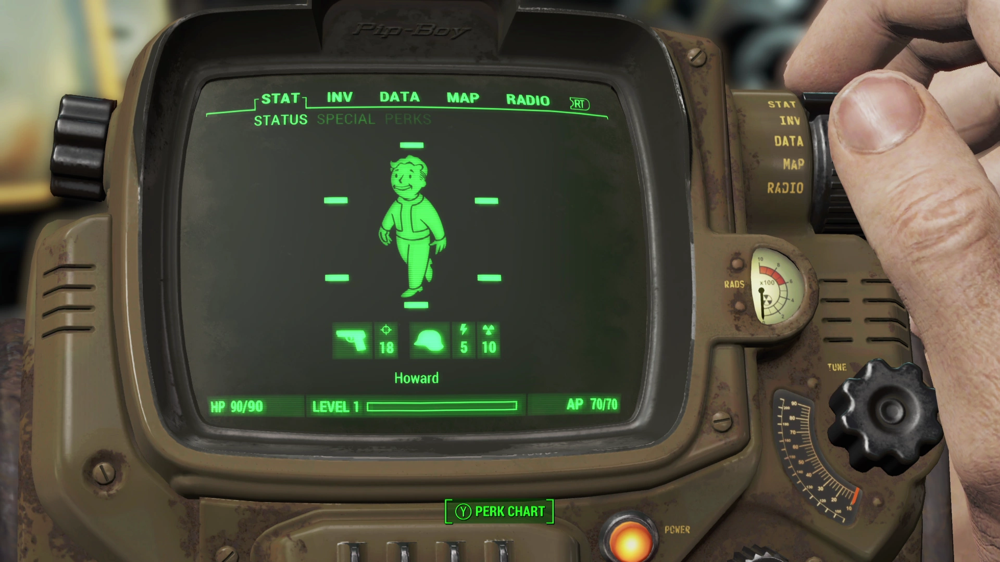

# Pip-Boy Portfolio 🎮

An interactive, Fallout-inspired Pip-Boy themed portfolio for Software Engineers. Built with Next.js, TypeScript, and Tailwind CSS.



## 🚀 Features

- **Authentic Pip-Boy Interface**: Complete with CRT screen effects, scanlines, and green terminal aesthetics
- **Interactive Tabs**: Navigate through different sections just like in Fallout 4
  - **STAT**: Display your skills using the S.P.E.C.I.A.L. system and perks
  - **INV**: Showcase your projects as an inventory system
  - **DATA**: Present your experience, education, and certifications as quest logs
  - **MAP**: Interactive contact information displayed as wasteland locations
  - **RADIO**: Blog posts and articles presented as radio stations
- **Fully Responsive**: Works on all devices
- **Real-time Clock**: Dynamic time display
- **Animated Elements**: Vault Boy animations and interactive hover effects

## 🛠️ Getting Started

### Prerequisites

- Node.js 18+
- npm or yarn

### Installation

1. Clone the repository:

```bash
git clone https://github.com/yourusername/pip-boy-portfolio.git
cd pip-boy-portfolio
```

2. Install dependencies:

```bash
npm install
```

3. Run the development server:

```bash
npm run dev
```

4. Open [http://localhost:3000](http://localhost:3000) in your browser

## 📝 Customization Guide

### 1. Personal Information

Update your personal details in the following files:

#### STAT Tab (Skills & About)

Edit `src/components/tabs/stat-tab.tsx`:

- Modify the `skills` array with your technical skills
- Update the `perks` array with your special abilities
- Change the level and experience values

#### INV Tab (Projects)

Edit `src/components/tabs/inventory-tab.tsx`:

- Replace the `projects` array with your own projects
- Update project links, descriptions, and technologies

#### DATA Tab (Experience & Education)

Edit `src/components/tabs/data-tab.tsx`:

- Update the `experiences` array with your work history
- Modify the `education` array with your educational background
- Add your certifications to the `certifications` array

#### MAP Tab (Contact Info)

Edit `src/components/tabs/map-tab.tsx`:

- Update the `locations` array with your contact information
- Modify URLs for GitHub, LinkedIn, Email, etc.

#### RADIO Tab (Blog/Articles)

Edit `src/components/tabs/radio-tab.tsx`:

- Replace the `stations` array with your blog posts or articles
- Update links to your actual blog posts

### 2. Styling Customization

The Pip-Boy theme can be customized in `src/app/globals.css`:

```css
:root {
  --pip-green: 41 255 101; /* Main green color */
  --pip-amber: 255 182 66; /* Amber accent color */
  --terminal-green: 33 255 33; /* Terminal text color */
}
```

### 3. Images

Replace the following images in the `public` folder:

- `pipboy.gif` - Main Vault Boy animation
- `pipboy_walking.gif` - Walking animation
- `pipboy.png` - Static Vault Boy image

### 4. Metadata

Update site metadata in `src/app/layout.tsx`:

- Title
- Description
- Author name
- OpenGraph data

## 🏗️ Project Structure

```
src/
├── app/
│   ├── globals.css       # Global styles and Pip-Boy theme
│   ├── layout.tsx        # Root layout with metadata
│   └── page.tsx          # Main page component
├── components/
│   ├── pip-boy.tsx       # Main Pip-Boy container
│   ├── tab-navigation.tsx # Tab navigation component
│   ├── clock.tsx         # Real-time clock component
│   └── tabs/
│       ├── stat-tab.tsx      # Skills and about section
│       ├── inventory-tab.tsx # Projects showcase
│       ├── data-tab.tsx      # Experience and education
│       ├── map-tab.tsx       # Contact information
│       └── radio-tab.tsx     # Blog/articles section
```

## 🚀 Deployment

### Vercel (Recommended)

1. Push your code to GitHub
2. Import your repository on [Vercel](https://vercel.com)
3. Deploy with default Next.js settings

### Other Platforms

The portfolio can be deployed to any platform that supports Next.js:

- Netlify
- AWS Amplify
- Railway
- Render

## 📦 Technologies Used

- **Next.js 14** - React framework with App Router
- **TypeScript** - Type safety
- **Tailwind CSS** - Utility-first styling
- **React** - UI library

## 🎨 Design Credits

Inspired by the Pip-Boy interface from Fallout 4 by Bethesda Game Studios.

## 📄 License

MIT License - feel free to use this for your own portfolio!

## 🤝 Contributing

Contributions are welcome! Feel free to:

- Report bugs
- Suggest new features
- Submit pull requests

---

**Note**: Remember to update all placeholder content with your actual information before deploying!
